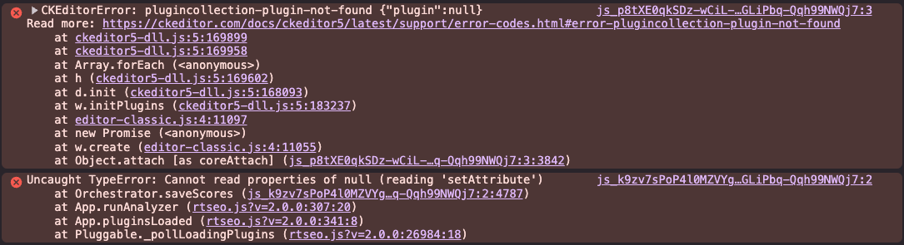
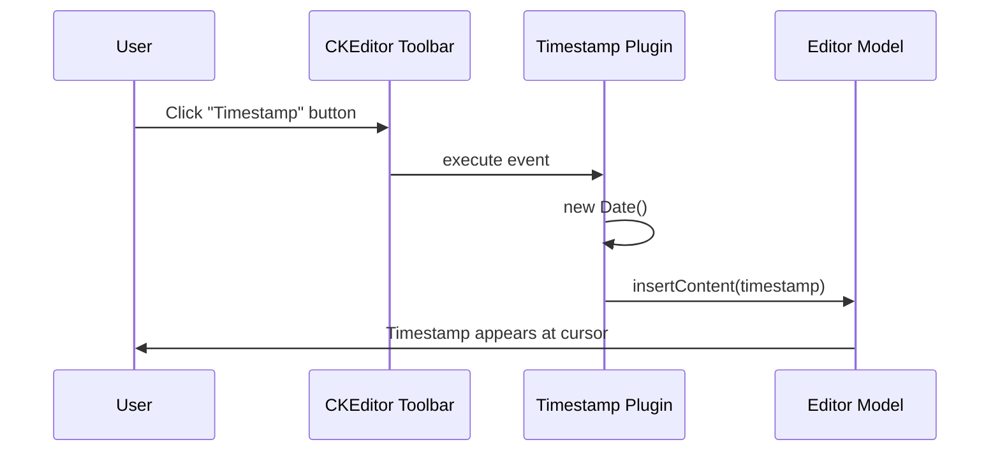
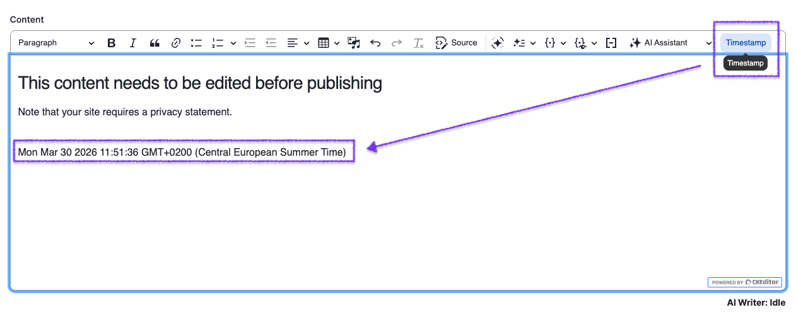
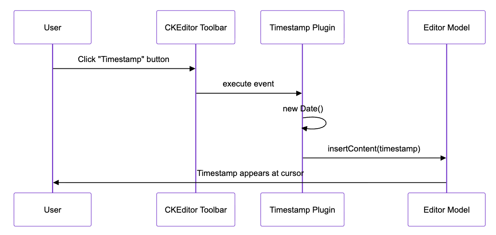

# How I vibe-coded my first custom module extending CKEditor without writing a single line of code

I was at DrupalCon Chicago, juggling booth duty, an AI Summit talk, and a Lightning Talk about CKEditor's contrib modules. But it's those hallway conversations that stick with you – and this time, the same question kept coming up.

"How do I customize CKEditor just a little bit?"

"Can I add my own button?"

"I want something specific to our workflow, but where do I even start?"

People knew what they wanted. They just didn't know how to get there.

So I grabbed Wojtek Kukowski – the main maintainer of the CKEditor Drupal integration – and asked him: "What's actually required to make this happen?"

He briefed me on the essentials. And I thought: "Let me try to translate this into a prompt for [Claude Code](https://docs.anthropic.com/en/docs/claude-code) and see what happens."

## The experiment

### Setup

- **Drupal**: 11.3.3.
- **Tool**: Claude Code.
- **Goal**: Create a CKEditor 5 plugin module from scratch.

### The prompt (almost too simple)

I kept it minimal:

> I would like to register a new module for Drupal based on the https://www.drupal.org/docs/develop/creating-modules information. I would like the module to be a CKEditor plugin https://ckeditor.com/docs/ckeditor5/latest/framework/tutorials/creating-simple-plugin-timestamp.html
>
> If you are not sure, ask me.

That's it. Two documentation links and an invitation to ask questions.

### What happened

1. **Claude explored the codebase** – it found existing CKEditor modules (Linkit, AI CKEditor) and learned from their patterns.

2. **Claude asked clarifying questions**:
   - What should the plugin do? (Insert timestamp.)
   - What should the module be called? (ckeditor5_timestamp.)
   - Toolbar button or context menu? (Toolbar button.)

3. **Claude created all the files** – module metadata, CKEditor configuration, JavaScript plugin, PHP class. Everything.

4. **Time**: A couple of minutes.

Let me show you what it generated.

## The files Claude created

### Module metadata

The standard `.info.yml` that tells Drupal about your module:

```yaml
name: CKEditor 5 Timestamp
type: module
description: "Adds a CKEditor 5 plugin that inserts the current timestamp at the cursor position."
package: CKEditor
core_version_requirement: "^10.1 || ^11"
```

### CKEditor plugin definition

This is where the magic happens – the `.ckeditor5.yml` file that registers your plugin with Drupal's CKEditor integration:

```yaml
ckeditor5_timestamp_timestamp:
  ckeditor5:
    plugins:
      - timestamp.Timestamp
  drupal:
    label: Timestamp
    library: ckeditor5_timestamp/timestamp
    toolbar_items:
      timestamp:
        label: Timestamp
    elements: false
```

### JavaScript plugin

The actual CKEditor 5 plugin that creates the toolbar button and handles the timestamp insertion:

```javascript
import { Plugin } from "ckeditor5/src/core";
import { ButtonView } from "ckeditor5/src/ui";

class Timestamp extends Plugin {
  init() {
    const editor = this.editor;

    editor.ui.componentFactory.add("timestamp", (locale) => {
      const button = new ButtonView(locale);

      button.set({
        label: "Timestamp",
        withText: true,
        tooltip: true,
      });

      button.on("execute", () => {
        const now = new Date();
        editor.model.change((writer) => {
          editor.model.insertContent(writer.createText(now.toString()));
        });
        editor.editing.view.focus();
      });

      return button;
    });
  }

  static get pluginName() {
    return "Timestamp";
  }
}

export default { Timestamp };
```

### PHP plugin class

A minimal PHP class that extends Drupal's CKEditor plugin system:

```php
<?php

declare(strict_types=1);

namespace Drupal\ckeditor5_timestamp\Plugin\CKEditor5Plugin;

use Drupal\ckeditor5\Plugin\CKEditor5PluginDefault;

/**
 * CKEditor 5 Timestamp plugin.
 */
class Timestamp extends CKEditor5PluginDefault {

}
```

## The gotcha (there's always one)

I enabled the module, cleared the cache, added the button to a text format... and hit this:

```plain
CKEditorError: plugincollection-plugin-not-found {"plugin":null}
Read more: https://ckeditor.com/docs/ckeditor5/latest/support/error-codes.html#error-plugincollection-plugin-not-found
```



### The problem

Drupal's CKEditor 5 uses a **DLL (Dynamic Link Library) pattern**. Raw ES modules don't work – plugins must be bundled in UMD format that exports to the `CKEditor5.[pluginname]` namespace.

Drupal core is discussing on an [Import Maps API](https://www.drupal.org/node/3398525) that might let browsers resolve ES module imports natively – no bundling to UDM required. If import maps land in Drupal core, you'll be able to write clean `import { Plugin } from 'ckeditor5/src/core'` statements and have the browser figure out the rest. [Browser support for import maps](https://caniuse.com/?search=import+map) is getting there too: Chrome 133+ and Safari already support multiple import maps, with Firefox ESR 153 expected around July 2026.

### The fix

Claude created a properly bundled version in `js/build/timestamp.js` and updated the library configuration to point to it:

<!-- TODO  - explain the section about the build and what I used: webpack in this case -->

```yaml
timestamp:
  js:
    js/build/timestamp.js: { minified: true }
  dependencies:
    - core/ckeditor5
```

**Total additional time**: About 2 minutes.

Voila! The timestamp button appeared in the toolbar, and clicking it inserted the current date and time.

<!-- IMAGE: Working timestamp button in CKEditor toolbar
**Prompt for image generator:** "CKEditor 5 toolbar showing a 'Timestamp' button, with text editor below containing an inserted timestamp like 'Wed Mar 25 2026 14:30:00 GMT+0100'. Clean, modern UI."

**Mermaid diagram (use https://mermaid.live to render):**

-->





## What you get

Two files that can help you extend CKEditor:

1. **SKILL.md** – A comprehensive guide teaching Claude Code how to:
   - Explore existing CKEditor implementations.
   - Ask the right clarifying questions.
   - Create all necessary files.
   - Handle the DLL bundling requirement.
   - Troubleshoot common issues.

2. **PROMPT.md** – A template you can customize:
   - Replace the plugin requirements with yours.
   - Specify your module name.
   - Define the UI type you need.

## How to use it

1. **Install Claude Code**: See the [official documentation](https://docs.anthropic.com/en/docs/claude-code).

2. **Put the files in your Drupal project**.

3. **Adjust PROMPT.md** with your requirements:
   - Plugin function: What should it do?
   - Module name: your_module_name.
   - UI type: Toolbar button, context menu, etc.

4. **Ask Claude to run it**:

   > Please create a CKEditor 5 plugin for Drupal following the SKILL.md approach using the requirements in PROMPT.md

5. **Enable and configure**:
   ```bash
   drush en your_module_name
   drush cr
   ```
   Then configure the text format in Drupal admin to add your new button.

## Try it yourself

My plugin was straightforward – a simple timestamp inserter. I'm curious how it works for you with more complex requirements.

- Did it work on the first try?
- What gotchas did you encounter?
- How complex was your plugin?

Find me at the CKEditor booth or on the conference Slack. I'd love to hear your stories.

You can check out the files like PROMPT.md and SKILL.md as well as the module files in the [GitHub repository](https://github.com/Simply007/drupalcon-chicago-26-ckeditor-ai-playground).

<!-- TODO: Extend the information about the build and github actions in the form of something like - and next to the SKILL and PROMPT, you have also this template with GitHub actions and webpack confing you can you to build and check you minified version oj your javascript.-->

Let's get to it!
