# Drupal AI Ecosystem - Visualizations & Glossary

This document provides comprehensive visualizations and terminology definitions for the Drupal AI module ecosystem. It includes both conceptual overviews for general understanding and technical diagrams with code references.

---

## Table of Contents

1. [Drupal AI Entities Explained](#drupal-ai-entities-explained)
   - [Entity Relationship Diagram](#entity-relationship-diagram)
   - [Entity Definitions](#entity-definitions-summary)
   - [AI Prompt Use Cases](#ai-prompt-use-cases)
2. [Conceptual Diagrams](#conceptual-diagrams)
   - [Architecture Overview](#1-architecture-overview-conceptual)
   - [Agent Workflow](#2-agent-workflow-conceptual)
   - [Capabilities Mind Map](#3-capabilities-mind-map)
3. [Technical Diagrams](#technical-diagrams)
   - [Architecture Detailed](#4-architecture-detailed-technical)
   - [Agent Loop Sequence](#5-agent-loop-sequence-technical)
   - [Entity Relationships](#6-entity-relationships)
   - [Orchestration Pattern](#7-orchestration-pattern)
4. [Your Configuration](#your-specific-configuration)
   - [Provider Mapping](#8-your-provider-mapping)
   - [Capability Matrix](#capability-matrix)
5. [Complete Ecosystem](#9-complete-ecosystem-overview)
6. [Glossary](#glossary)
   - [AI Core Terms](#ai-core-terms)
   - [Drupal AI Entities](#drupal-ai-entities)
   - [Operation Types](#operation-types-capabilities)

---

# Drupal AI Entities Explained

This section provides a focused overview of the core Drupal AI entities and how they work together. Understanding these relationships is key to leveraging the full power of Drupal's AI ecosystem.

## Drupal AI Entities Overview

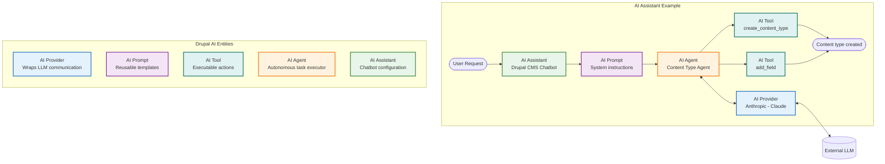

**Flow explanation:**
1. **User** asks the chatbot to create a Blog content type
2. **AI Assistant** (Drupal CMS Chatbot) receives the request
3. **AI Prompt** provides system instructions defining the assistant's behavior
4. **AI Agent** (Content Type Agent) is invoked to handle the task autonomously
5. **AI Provider** sends requests to the external LLM (Claude/Anthropic)
6. **AI Tools** execute the actual Drupal operations (`create_content_type()`, `add_field()`)
7. **Result**: Blog content type is created in Drupal

## Entity Definitions Summary

| Entity | Type | What It Does | Official Documentation |
|--------|------|--------------|------------------------|
| **AI Provider** | Plugin | **The foundation layer** - wraps ALL communication with external LLMs. Handles API calls, authentication, and translates Drupal requests into service-specific API interactions. Every other entity goes through a Provider. | [Writing an AI Provider](https://project.pages.drupalcode.org/ai/2.0.x/developers/writing_an_ai_provider/) |
| **AI Agent** | Config Entity | **Autonomous AI system** - has a system prompt, available tools (function calls), and runs in a loop until the task is complete. Can use tools to modify Drupal config, create content, and even orchestrate other agents. Most powerful entity. | [Building an Agent](https://project.pages.drupalcode.org/ai/2.0.x/agents/build_agent/) |
| **AI Assistant** | Config Entity | **Chatbot configuration** - normalizes interactions between users and LLMs as chatbots. Defines which "actions" (not tools) the chatbot can trigger. Powers the AI Chatbot UI module. | [AI Assistant API](https://project.pages.drupalcode.org/ai/2.0.x/modules/ai_assistant_api/) |
| **AI Automator** | Config Entity | **Field-level automation** - attaches to specific entity fields and automatically generates/modifies field values when content is saved. Can chain multiple automators for complex workflows. | [AI Automators](https://project.pages.drupalcode.org/ai/2.0.x/modules/ai_automators/) |
| **AI Prompt** | Config Entity | **Reusable prompt templates** - stores prompt text with variables (`{word}`) and tokens (`[node:title]`). Bundled by AI Prompt Type. Enables centralized prompt management across all AI features. | [Prompt Management](https://project.pages.drupalcode.org/ai/2.0.x/developers/ai_prompt_management/) |
| **AI Chat** | Operation Type | **Not an entity** - it's a capability/operation type that defines conversational calls to LLMs. Variants include basic chat, streaming, with tools, with vision, etc. | [Chat Call](https://project.pages.drupalcode.org/ai/2.0.x/developers/call_chat/) |
| **AI Tool** | Plugin | **Executable actions** - plugins that AI Agents can call during their execution loop. Includes Function Calls (create content types, modify fields) and Assistant Actions (search, fetch data). The "hands" of the AI. | [Function Calling](https://project.pages.drupalcode.org/ai/2.0.x/developers/function_calling/) |

## How They Work Together

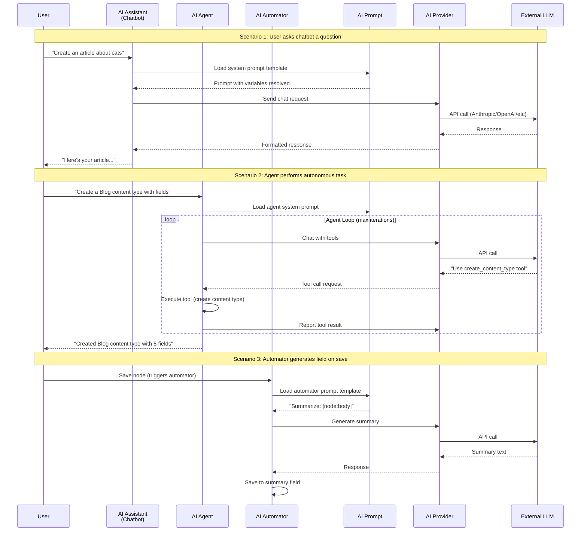

## AI Prompt Use Cases

**AI Prompt** is a shared infrastructure entity that can be used by multiple consumer entities. Here's where and how it's used:

| Consumer | How AI Prompt Is Used | Example |
|----------|----------------------|---------|
| **AI Agent** | Defines the agent's system prompt and behavior instructions | *"You are a Drupal assistant. Use tools to help users manage content types."* |
| **AI Assistant** | Provides the chatbot's personality and conversation style | *"You are a helpful customer service bot for {site_name}. Be friendly and concise."* |
| **AI Automator** | Templates for field generation with token replacement | *"Generate a summary of the following content: [node:body:value]"* |
| **AI CKEditor** | Prompts for in-editor AI assistance (tone adjustment, translation) | *"Rewrite the following text in a {tone} tone: {text}"* |
| **AI Content** | Prompts for content operations (summarize, suggest tags) | *"Suggest 5 taxonomy terms for: [node:title]"* |
| **Custom Modules** | Any module can load and use AI Prompts via the API | Developer-defined prompts for custom AI features |

### AI Prompt Structure

```
┌─────────────────────────────────────────────────────────┐
│ AI Prompt Type: "content_summary"                       │
│   - Allowed variables: {max_length}, {style}            │
│   - Allowed tokens: [node:*], [current-user:*]          │
├─────────────────────────────────────────────────────────┤
│ AI Prompt: "content_summary__blog_summary"              │
│   Prompt text:                                          │
│   "Summarize the following blog post in {max_length}    │
│    words using a {style} style:                         │
│    Title: [node:title]                                  │
│    Body: [node:body:value]"                             │
└─────────────────────────────────────────────────────────┘
```

### Loading AI Prompts in Code

```php
// Load an AI Prompt entity
$prompt = \Drupal::entityTypeManager()
  ->getStorage('ai_prompt')
  ->load('content_summary__blog_summary');

// Get the prompt text and replace variables
$prompt_text = $prompt->get('prompt')->value;
$prompt_text = str_replace('{max_length}', '100', $prompt_text);
$prompt_text = str_replace('{style}', 'professional', $prompt_text);

// Replace tokens using Drupal's token service
$prompt_text = \Drupal::token()->replace($prompt_text, ['node' => $node]);
```

## Key Relationships Explained

### 1. AI Provider is the Foundation

Everything flows through the AI Provider. It's the **only entity that communicates with external LLMs**.

```
AI Agent ──────┐
AI Assistant ──┼──► AI Provider ──► External LLM (OpenAI, Anthropic, etc.)
AI Automator ──┘
```

**Source:** [AI Provider Architecture](https://project.pages.drupalcode.org/ai/2.0.x/developers/writing_an_ai_provider/)

### 2. AI Agent vs AI Assistant

| Aspect | AI Agent | AI Assistant |
|--------|----------|--------------|
| **Purpose** | Autonomous task execution | User-facing conversations |
| **Execution** | Loops until task complete | Single request-response |
| **Capabilities** | Uses **tools** (function calling) | Triggers **actions** (plugins) |
| **Scope** | Can modify Drupal config, create views, etc. | Responds to user queries, triggers limited actions |
| **Use Case** | "Create a content type with these fields" | "What are today's news articles?" |

**Source:** [AI Agents Module](https://www.drupal.org/project/ai_agents) | [AI Assistant API](https://project.pages.drupalcode.org/ai/2.0.x/modules/ai_assistant_api/)

### 3. AI Automator Chains

Automators can be chained to create complex workflows:

```
┌─────────────┐    ┌─────────────┐    ┌─────────────┐
│ Automator 1 │───►│ Automator 2 │───►│ Automator 3 │
│ Extract text│    │ Summarize   │    │ Translate   │
│ from PDF    │    │ content     │    │ to Spanish  │
└─────────────┘    └─────────────┘    └─────────────┘
     Weight: 0          Weight: 1          Weight: 2
```

**Source:** [AI Automators Documentation](https://project.pages.drupalcode.org/ai/2.0.x/modules/ai_automators/)

---

## Official Resources

| Resource | URL |
|----------|-----|
| **Drupal AI Module** | https://www.drupal.org/project/ai |
| **AI 2.0.x Documentation** | https://project.pages.drupalcode.org/ai/2.0.x/ |
| **AI Agents Module** | https://www.drupal.org/project/ai_agents |
| **AI Agents Documentation** | https://project.pages.drupalcode.org/ai_agents |
| **AI Provider Development** | https://project.pages.drupalcode.org/ai/2.0.x/developers/writing_an_ai_provider/ |
| **AI Prompt Management** | https://project.pages.drupalcode.org/ai/2.0.x/developers/ai_prompt_management/ |
| **AI Automators** | https://project.pages.drupalcode.org/ai/2.0.x/modules/ai_automators/ |
| **AI Assistant API** | https://project.pages.drupalcode.org/ai/2.0.x/modules/ai_assistant_api/ |

---

# Conceptual Diagrams

## 1. Architecture Overview (Conceptual)

A simplified view of how Drupal AI is structured in layers:

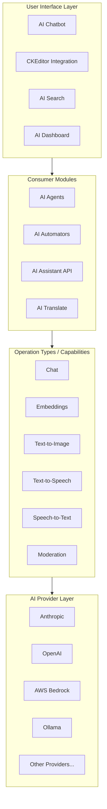

**Description:** This diagram shows the four main layers of Drupal AI:
1. **UI Layer** - User-facing components (chatbots, editor integrations)
2. **Consumer Modules** - Modules that use AI capabilities (agents, automators)
3. **Capabilities** - The types of AI operations available
4. **Providers** - External AI services that power the capabilities

---

## 2. Agent Workflow (Conceptual)

How an AI Agent processes a request:

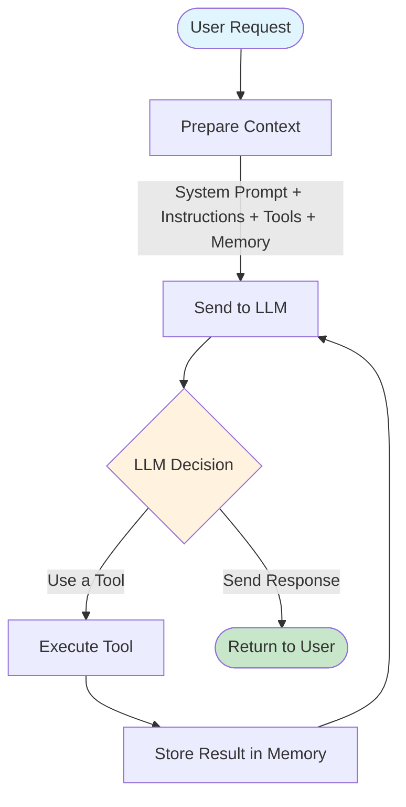

**Description:** The Agent Loop:
1. User sends a request
2. System prepares context (prompts, available tools, conversation history)
3. LLM decides: use a tool OR respond
4. If tool: execute it, store result, loop back to LLM
5. If response: return to user

---

## 3. Capabilities Mind Map

All AI operation types available in Drupal AI:

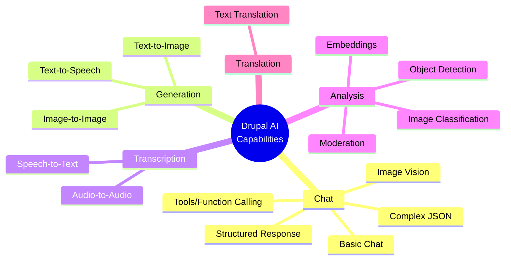

**Description:** Drupal AI supports multiple capability categories:
- **Chat** - Conversational AI with various enhancements
- **Generation** - Creating media from text
- **Transcription** - Converting audio to text
- **Analysis** - Understanding and classifying content
- **Translation** - Language conversion

---

# Technical Diagrams

## 4. Architecture Detailed (Technical)

Full architecture with service classes and plugin managers:

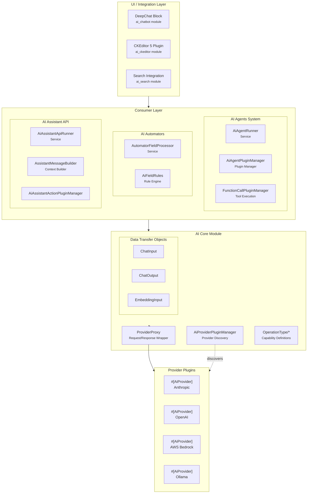

**Key Files:**
- Provider Manager: `web/modules/contrib/ai/src/AiProviderPluginManager.php`
- Agent Runner: `web/modules/contrib/ai_agents/src/Service/AiAgentRunner.php`
- Function Calling: `web/modules/contrib/ai/src/Service/FunctionCalling/`
- Operation Types: `web/modules/contrib/ai/src/OperationType/`

---

## 5. Agent Loop Sequence (Technical)

Detailed sequence showing the agent execution loop with classes:

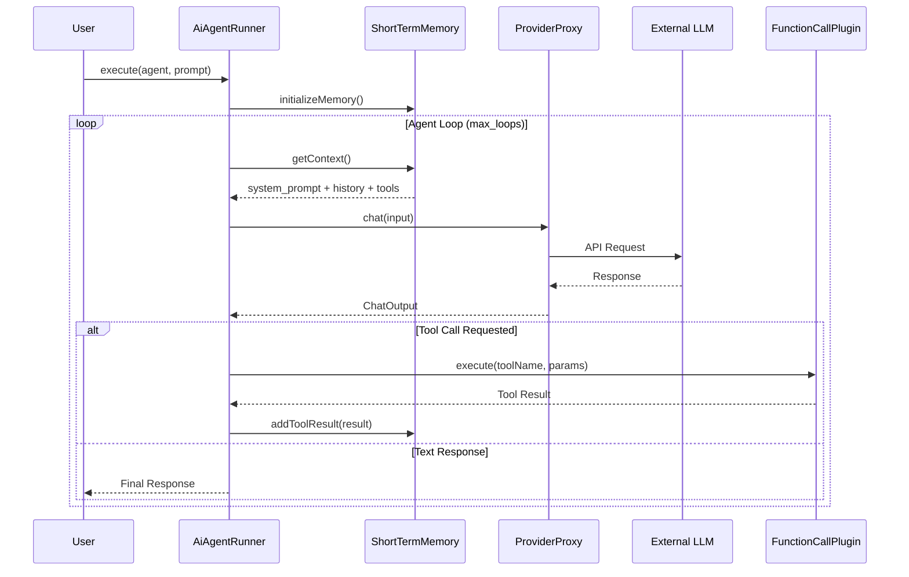

**Key Classes:**
- `AiAgentRunner` - Orchestrates the loop
- `AiShortTermMemoryPluginManager` - Manages conversation context
- `ProviderProxy` - Wraps provider calls with events/logging
- `ExecutableFunctionCallInterface` - Tool execution contract

---

## 6. Entity Relationships

Drupal configuration entities in the AI ecosystem:

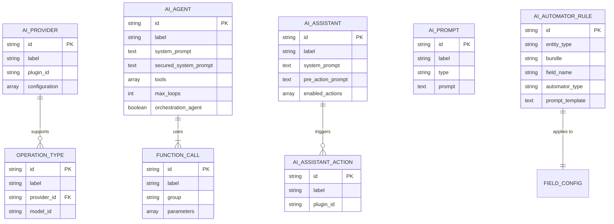

**Entity Locations:**
- AI Provider: Plugin-based (not config entity)
- AI Agent: `web/modules/contrib/ai_agents/src/Entity/AiAgent.php`
- AI Prompt: `web/modules/contrib/ai/src/Entity/AiPrompt.php`
- AI Assistant: `web/modules/contrib/ai/modules/ai_assistant_api/`

---

## 7. Orchestration Pattern

Multi-agent hierarchy (centralized orchestration):

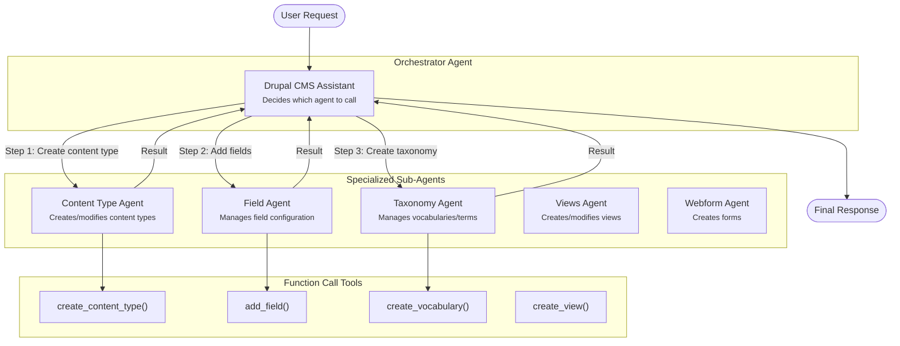

**Description:** Orchestration allows a parent agent to:
1. Analyze the user's complex request
2. Break it into smaller tasks
3. Delegate to specialized sub-agents
4. Collect results and provide unified response

---

# Your Specific Configuration

## 8. Your Provider Mapping

Your current Drupal AI setup with Anthropic and OpenAI:

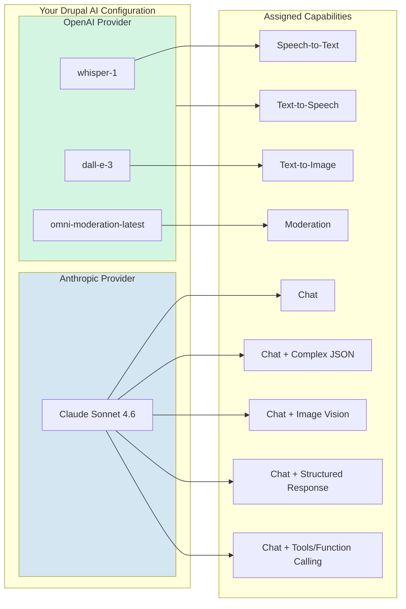

## Capability Matrix

| Capability | Provider | Model |
|------------|----------|-------|
| Chat | Anthropic | Claude Sonnet 4.6 |
| Chat with Complex JSON | Anthropic | Claude Sonnet 4.6 |
| Chat with Image Vision | Anthropic | Claude Sonnet 4.6 |
| Chat with Structured Response | Anthropic | Claude Sonnet 4.6 |
| Chat with Tools/Function Calling | Anthropic | Claude Sonnet 4.6 |
| Moderation | OpenAI | omni-moderation-latest |
| Speech to Text | OpenAI | whisper-1 |
| Text to Image | OpenAI | dall-e-3 |
| Text to Speech | OpenAI | *(configured)* |

---

## 9. Complete Ecosystem Overview

Everything combined in one diagram:

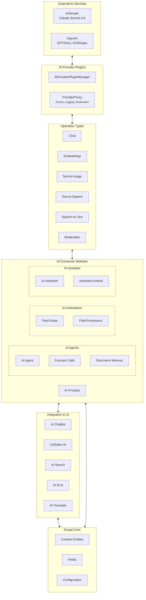

---

# Glossary

## AI Core Terms

| Term | Definition |
|------|------------|
| **AI** | Artificial Intelligence - Computer systems that perform tasks typically requiring human intelligence (learning, reasoning, problem-solving) |
| **LLM** | Large Language Model - An AI model trained on vast amounts of text data to understand and generate human-like language. Examples: GPT-4, Claude, Llama |
| **Model** | A specific trained version of an AI system. Example: "Claude Sonnet 4.6" is a model from Anthropic |
| **MCP** | Model Context Protocol - A standardized protocol for connecting AI models to external tools and data sources |
| **Tool** | A piece of code or external service that an LLM can request to execute. Also called "function calling" |
| **Embedding** | A numerical vector representation of text that captures semantic meaning. Used for similarity search and RAG |
| **Agent** | An autonomous AI system that can use tools, maintain memory, and make decisions to accomplish tasks. Per Anthropic: "Systems where LLMs dynamically direct their own processes and tool usage" |
| **RAG** | Retrieval-Augmented Generation - Technique of fetching relevant documents before generating responses to ground the AI in factual data |
| **Token** | The basic unit of text processing for LLMs. Roughly 4 characters or 3/4 of a word in English |
| **Context Window** | The maximum amount of text (in tokens) an LLM can process in a single request |
| **System Prompt** | Instructions provided to the LLM that define its behavior, personality, and constraints |
| **Function Calling** | The ability for an LLM to request execution of predefined functions/tools and receive their results |

## Drupal AI Entities

| Entity | Type | Description |
|--------|------|-------------|
| **AI Provider** | Plugin | Connects Drupal to external AI services. Implements `AiProviderInterface`. Discovered via `#[AiProvider]` attribute |
| **AI Agent** | Config Entity | An autonomous entity with a system prompt, available tools, and execution loop. Can call other agents (orchestration) |
| **AI Chat** | Interface | Real-time conversational interaction with an LLM. Implemented through Chat operation type |
| **AI Assistant** | Config Entity | A configured chatbot instance with specific prompts, enabled actions, and conversation settings |
| **AI Automator** | Config Entity | Rule-based automation that generates field values using AI when content is created/updated |
| **AI Prompt** | Config Entity | Reusable prompt template with variable substitution. Can be bundled by type |
| **Function Call** | Plugin | A tool that agents can execute. Defined with `#[FunctionCall]` attribute, implements `ExecutableFunctionCallInterface` |
| **AI Assistant Action** | Plugin | Actions that the Assistant API can trigger based on LLM decisions |
| **Operation Type** | Interface | Defines a specific AI capability (Chat, Embeddings, etc.) with input/output DTOs |

## Operation Types (Capabilities)

| Capability | Description | Use Cases |
|------------|-------------|-----------|
| **Chat** | Basic conversational AI | Q&A, content generation, summarization |
| **Chat with Complex JSON** | Chat that returns structured JSON | API responses, structured data extraction |
| **Chat with Image Vision** | Chat that can analyze images | Image description, visual Q&A, OCR |
| **Chat with Structured Response** | Chat with schema-validated output | Form filling, typed responses |
| **Chat with Tools/Function Calling** | Chat that can execute tools | Agents, automated workflows, data retrieval |
| **Moderation** | Content safety analysis | Harmful content detection, policy compliance |
| **Speech to Text** | Audio transcription | Meeting notes, podcast transcription |
| **Text to Speech** | Audio generation from text | Accessibility, voice content |
| **Text to Image** | Image generation from prompts | Illustrations, thumbnails, creative content |
| **Embeddings** | Vector representation of text | Semantic search, similarity matching, RAG |
| **Image Classification** | Categorizing images | Auto-tagging, content organization |
| **Object Detection** | Identifying objects in images | Image analysis, accessibility |
| **Text Translation** | Language conversion | Multilingual content |

---

## Reference Links

### Official Documentation
- Drupal AI Module: https://project.pages.drupalcode.org/ai/
- AI Agents: https://www.drupal.org/project/ai_agents

### Key Files in Your Installation
```
web/modules/contrib/ai/
├── src/
│   ├── AiProviderPluginManager.php    # Provider discovery
│   ├── AiProviderInterface.php        # Provider contract
│   ├── OperationType/                 # Capability definitions
│   │   ├── Chat/
│   │   ├── Embeddings/
│   │   └── ...
│   ├── Entity/
│   │   └── AiPrompt.php              # Prompt entity
│   └── Service/
│       └── FunctionCalling/          # Tool execution
│
├── modules/
│   ├── ai_assistant_api/             # Assistant/Chatbot
│   ├── ai_automators/                # Field automation
│   ├── ai_chatbot/                   # DeepChat UI
│   └── ai_search/                    # Search integration
│
└── docs/                             # MkDocs documentation

web/modules/contrib/ai_agents/
├── src/
│   ├── Entity/AiAgent.php            # Agent config entity
│   └── Service/AiAgentRunner.php     # Agent execution
└── docs/                             # Agent documentation
```

---

*Generated for Drupal AI ecosystem documentation. Last updated: April 20, 2026*
